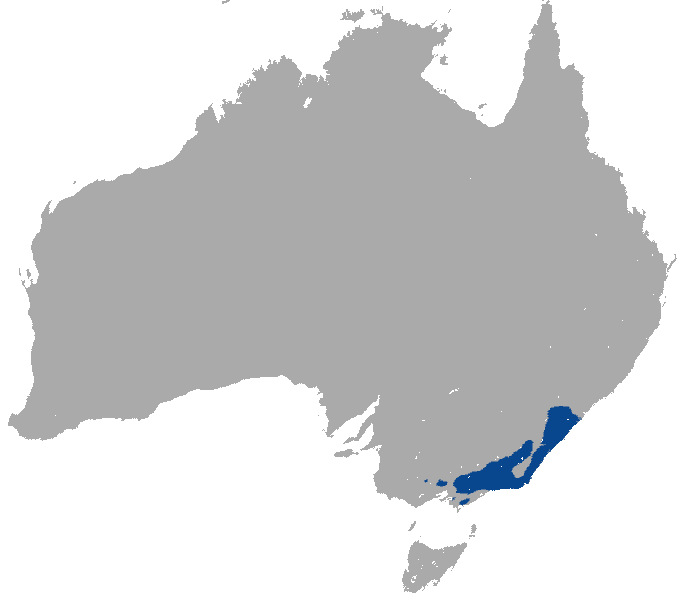
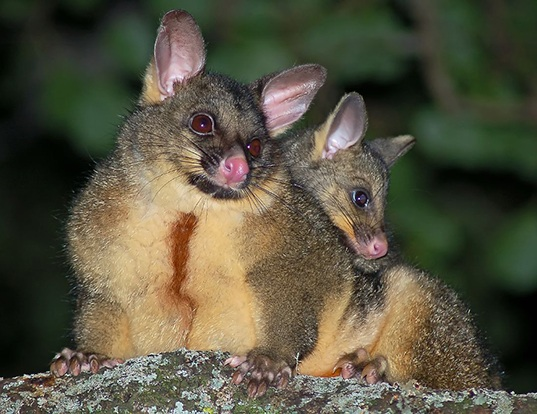
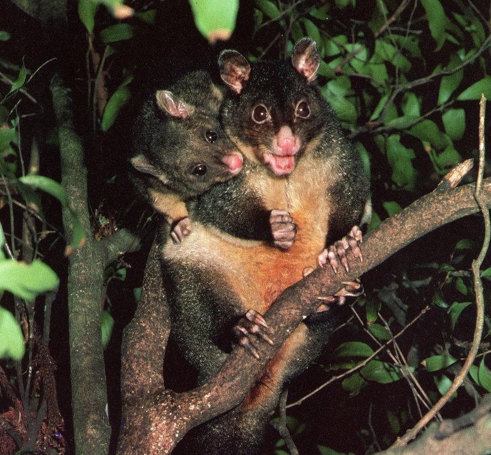
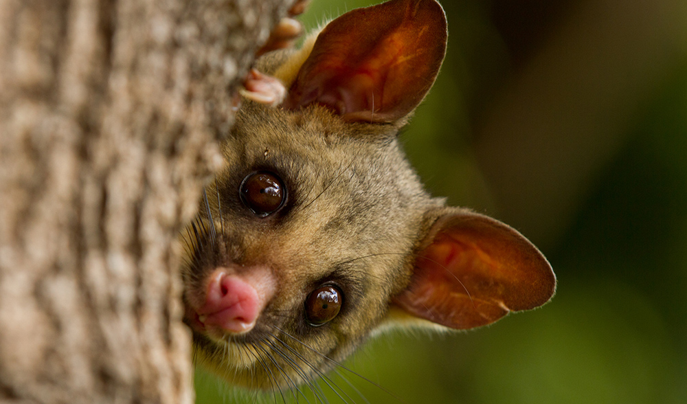

```{r setup, include=FALSE}
knitr::opts_chunk$set(echo = FALSE)
```

## Data Set Background
The possum data frame consists of nine morphometric measurements on 104 mountain brushtail possums, trapped at seven sites from Southern Victoria to central Queensland. In 2002, they were proposed to be reclassified into two separate species: the mountain brushtail and short-eared.  

Source <br /> 
> Lindenmayer, D. B., Viggers, K. L., Cunningham, R. B., and Donnelly, C. F. 1995. Morphological variation among columns of the mountain brushtail possum, Trichosurus caninus Ogilby (Phalangeridae: Marsupiala). Australian Journal of Zoology 43: 449-458.  <br /> 
> URL: https://vincentarelbundock.github.io/Rdatasets/datasets.html

***


## Loading the Libraries and Reading the Data
```{r message=FALSE, warning=FALSE}
library(tidyverse)
library(skimr)
library("RColorBrewer")
```
```{r message=FALSE, warning=FALSE}
 possum <- 
   readr::read_csv(file = "possum.csv", na = c("", " ", "NA", "#N/A", "-999", "\\"))
```
library(tidyverse)  
library(skimr)  
library("RColorBrewer")  

 possum <- 
   readr::read_csv(file = "possum.csv", na = c("", " ", "NA", "#N/A", "-999", "\\"))

## Overview of Data
Check dimensions   
dim(possum)
```{r}
# Check dimensions
dim(possum)
```

Check column names
colnames(possum)
```{r}
# Check column names
colnames(possum)
```
---

```{r}
# Check for NA's
##install.packages("skimr")
possum %>% skimr::skim()
```

## Renaming variables for consistency 
```{r}
possum <-
  possum%>% 
  dplyr::rename(
    pop = Pop, #population
    foot = footlgth, #foot length
    head = hdlngth, #head length
    skull = skullw, #skull width
    tail = taill, #tail length
    tooth = totlngth #tooth length
    ) 
```

possum <-
  possum%>%   
  dplyr::rename(  
    pop = Pop, #population  
    foot = footlgth, #foot length  
    head = hdlngth, #head length  
    skull = skullw, #skull width  
    tail = taill, #tail length  
    tooth = totlngth #tooth length  
    ) 

## Dataset Cleaning-Up
This data frame is not tidy, because the first column does not have a column name (it got assigned X1 as its name automatically by R).

How to change that:
```{r}
#rename X1 into sample
colnames(possum)<-c("sample","case","site","pop", "sex","age","head","skull","tooth","tail","foot","earconch","eye","chest","belly")
```
Rename X1 into sample  
colnames(possum)<-c("sample","case","site","pop", "sex","age","head","skull","tooth","tail","foot","earconch","eye","chest","belly")

We've also noticed that the columns are variables, so that would need to be addressed later on when we start using the data to make visualizations. 

## Identifying the NA's
Which column has the most NA's? 
```{r}
possum %>%   
  purrr::map_df(~ sum(is.na(.))) %>% 
  tidyr::gather(key="variables", value="num_nas") %>% 
  arrange(desc(num_nas))
```


## Research Topic

In 2002, it was proposed that the mountain brushtail possum be reclassified into two distinct species: the northern short-eared possum and the southern mountain brushtail possum. 

Can this dataset justify separating the possum into two species by morphometrics?

## Main Question 1 | Is there a difference in possum morphology between populations in Victoria (the south) and populations outside of Victoria (the north)?

---
```{r}
possum %>% gather(head, skull, tooth, tail, foot, earconch, eye, chest, belly, key=morph, value=measure) %>% group_by(pop) %>% 
  ggplot(aes(x=morph, y=measure, fill=pop))+ geom_boxplot()+
  labs(title="Morphologies by Population", x = "Morphology", y = "Measures")+
  theme(plot.title = element_text(face="bold", hjust = 0.5))+
  scale_fill_brewer(palette = "Set1")
```
We expected a difference in earconch lengths since it is the defining morphological difference between the two proposed species of possums.

---
## Sub Question 1| Difference in ear conch length between both populations?
---

```{r}
possum %>% 
  ggplot(aes(x=age, y=earconch, fill = pop))+ geom_boxplot()+
  labs(title = "Relationship Between Possum Age and Ear Conch Length", x= "Age", y= "Ear Conch Length")+
  scale_fill_brewer(palette = "Set1")
```

There is a significant difference in  ear conch length between two populations. 

## Sub Question 2| Correlation between age and ear conch length?

---

```{r}
possum %>% 
  ggplot(aes(x=age, y=earconch, color = pop))+ geom_point()+
  labs(title = "Relationship Between Possum Age and Ear Conch Length", 
       x= "Age", y= "Ear Conch Length")+
  scale_color_brewer(palette = "Set1")
```

No correlation between age and ear conch length. The difference in ear conch leangth is very likely to be determined solely by the population that they belong to. 

---
## Sub Question 3| Comparision of ear conch length by sex in both populations?
---

```{r}
possum %>% ggplot(aes(x=sex, y=earconch, color = pop))+ geom_point()+
  labs(title = "Relationship Between Possum Age and Ear Conch Length", 
       x= "Sex", y= "Ear Conch Length")+
  scale_color_brewer(palette = "Set1")
```

No correlation between sex and ear conch length. Males and females of the same population display similar ear conch length. The difference in ear conch leangth is very likely to be determined solely by the population that they belong to. 

## Main Question 2

The mountain brushtail possum shows little sexual dimorphism, meaning that the females and males of this species show little distinct characteristics beyond their sexual organs.

Examine if it is true that the two populations of possum show little sexual dimorphism.

## Sub Question 1

What is the count of females and males in both populations?

## Count of Possums by Sex in Victoria
```{r}
possum %>% filter (pop == "Vic") %>% 
  ggplot(aes(x=sex, fill=sex))+ geom_bar()+
  labs(title = "Count of Possums by Sex in Victoria", x= "Sex", y= "Count")+
  scale_fill_brewer(palette = "Set1")
```

We can see that there is a relatively equal ratio of female to male in the mountain bushtail possums of Victoria. 

## Count of Possums by Sex in Others
```{r}
possum %>% filter (pop == "other") %>% 
  ggplot(aes(x=sex, fill=sex))+ geom_bar()+
  labs(title = "Count of Possums by Sex Outside of Victoria", x= "Sex", y= "Count")+
  scale_fill_brewer(palette = "Set1")
```

The ratio of female to male is almost 2:1 in the short-eared possums outside of Victoria. 

## Compare relative densities of sex by population
```{r}
possum %>% 
  ggplot(aes(x=pop, y=sex, color=pop))+ geom_count()+  #this is a count plot
  scale_size_area(max_size = 28)+
  labs(title="Density of Sex by Population", x="Population", y="Sex")+
  scale_color_brewer(palette = "Set1")
```

---
## Sub Question 2| Morphologies by Populations by sex
---

```{r}
# Morphologies of Possums by Sex in Victoria
possum %>% filter(pop == "Vic") %>% gather(head, skull, tooth, tail, foot, earconch, eye, chest, belly, key=morph, value=measure) %>% group_by(sex) %>% 
  ggplot(aes(x=morph, y=measure, fill=sex))+ geom_boxplot()+
  labs(title = "Morphologies of Possums by Sex in Victoria", x= "Sex", y= "Count")+scale_fill_brewer(palette = "Set1")
```

Female and male mountain brushtail possums in Victoria have similar ranges of morphological characteristics, furthering how this particular species display little sexual dimorphism. 

---
# Morphologies of Possums by Sex Outside of Victoria
---

```{r}
possum %>% filter(pop == "other") %>% gather(head, skull, tooth, tail, foot, earconch, eye, chest, belly, key=morph, value=measure) %>% group_by(sex) %>% 
  ggplot(aes(x=morph, y=measure, fill=sex))+ geom_boxplot()+
  labs(title = "Morphologies of Possums by Sex Outside of Victoria", x= "Sex", y= "Count")+
  scale_fill_brewer(palette = "Set1")
```

The males of the short-eared possums population outside of Victoria display a wider range of morphological characteristics than females. 

## Conclusion

In conclusion, we agree with the justifications for splitting the possums into two separate species. 

Both species show morphologial difference, especially in regards to earconch length and feet length. 

The species from the south, the mountain brushtail possums, show little sexual dimorphism; the species from the north, the short-eared possums, have males that are more varied in size and shape than females. 

The ratio of male to female is closer to 1:1 in the mountain brushtail possums, indicating a monogamous population; the ratio of male to female is almost 2:1 in the short-eared possums, indicating a polygynous population; this also might suggest a difference in gene between the two populations. 


## Mountain Brushtail Possum
```{r}

```

## Short-eared Possum
```{r}

```

## Additional Information & Research

*Australian museum*
https://australianmuseum.net.au/learn/animals/mammals/mammology-collection-mountain-brushtail-possum/  <br /> 
*Geographic dimorphism in the mountain brushtail possum (Trichosurus caninus): The case for a new species*
https://www.researchgate.net/publication/240510066_Geographic_dimorphism_in_the_mountain_brushtail_possum_Trichosurus_caninus_The_case_for_a_new_species

```{r}

```


