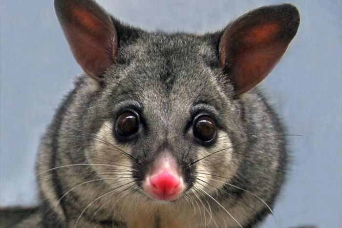
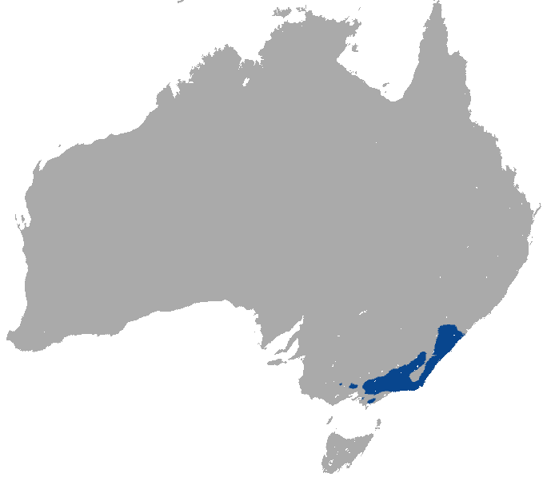
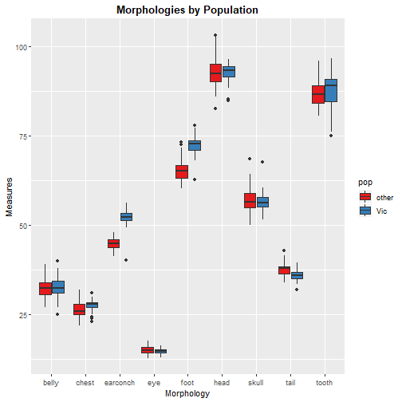
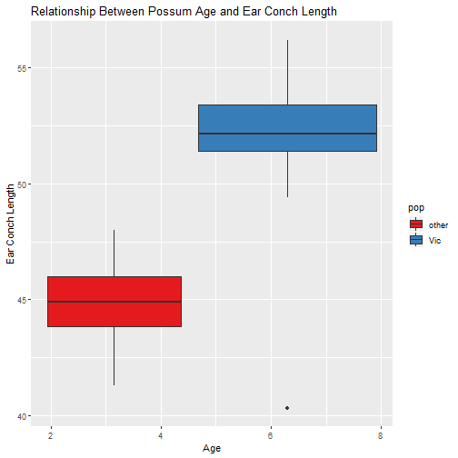
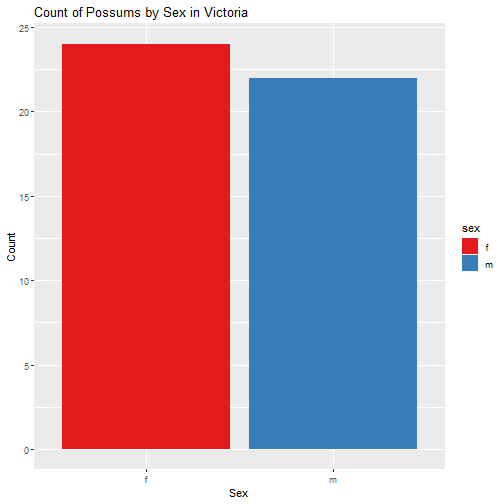
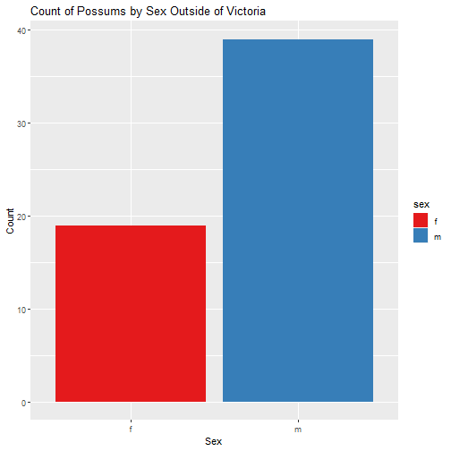
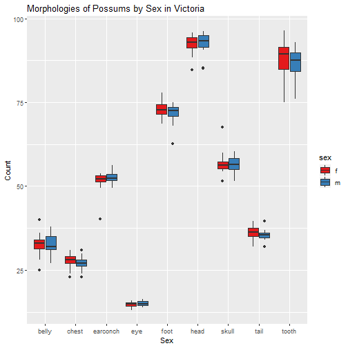
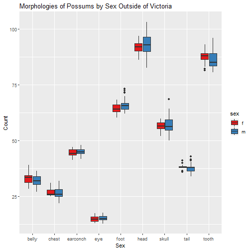
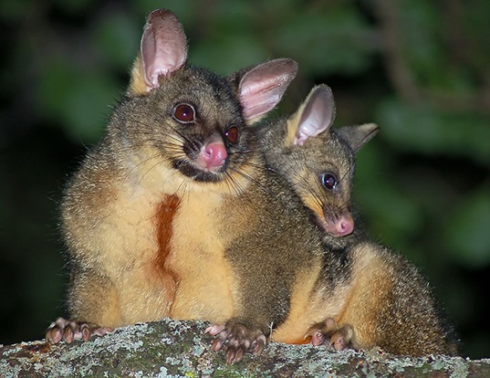
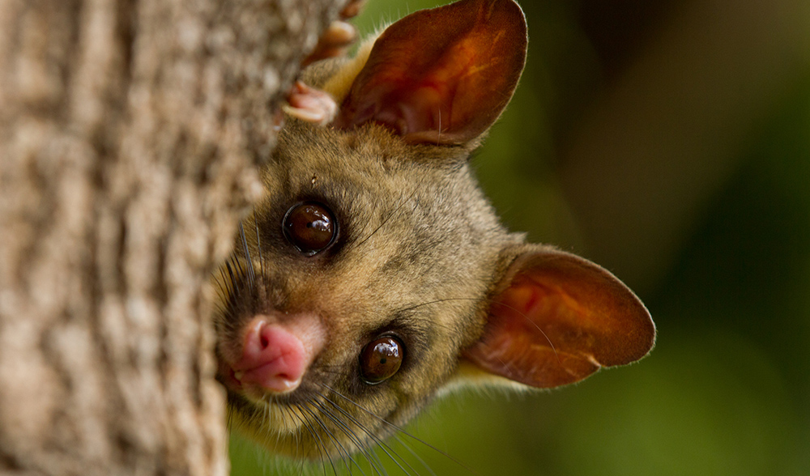

Morphometric Variations in Australian Possums
========================================================
author: April & Yi
date: Winter 2019
autosize: true
***


Data Set Background
========================================================
The possum data frame consists of nine morphometric measurements on 104 mountain brushtail possums, trapped at seven sites from Southern Victoria to central Queensland. In 2002, they were proposed to be reclassified into two separate species: the mountain brushtail and short-eared.  

Source
> Lindenmayer, D. B., Viggers, K. L., Cunningham, R. B., and Donnelly, C. F. 1995. Morphological variation among columns of the mountain brushtail possum, Trichosurus caninus Ogilby (Phalangeridae: Marsupiala). Australian Journal of Zoology 43: 449-458.  <br /> 
> URL: https://vincentarelbundock.github.io/Rdatasets/datasets.html

***


Loading the Libraries and Reading the Data
========================================================

```r
library(tidyverse)
library(skimr)
library("RColorBrewer")
```

```r
 possum <- 
   readr::read_csv(file = "possum.csv", na = c("", " ", "NA", "#N/A", "-999", "\\"))
```

Overview of Data
========================================================

```r
# Check dimensions
dim(possum)
```

```
[1] 104  15
```

```r
# Check column names
colnames(possum)
```

```
 [1] "X1"       "case"     "site"     "Pop"      "sex"      "age"     
 [7] "hdlngth"  "skullw"   "totlngth" "taill"    "footlgth" "earconch"
[13] "eye"      "chest"    "belly"   
```

========================================================

```r
# Check for NA's
##install.packages("skimr")
possum %>% skimr::skim()
```

```
Skim summary statistics
 n obs: 104 
 n variables: 15 

-- Variable type:character -------------------
 variable missing complete   n min max empty n_unique
      Pop       0      104 104   3   5     0        2
      sex       0      104 104   1   1     0        2
       X1       0      104 104   2   5     0      104

-- Variable type:numeric ---------------------
 variable missing complete   n  mean    sd   p0   p25   p50   p75  p100
      age       2      102 104  3.83  1.91  1    2.25  3     5      9  
    belly       0      104 104 32.59  2.76 25   31    32.5  34.12  40  
     case       0      104 104 52.5  30.17  1   26.75 52.5  78.25 104  
    chest       0      104 104 27     2.05 22   25.5  27    28     32  
 earconch       0      104 104 48.13  4.11 40.3 44.8  46.8  52     56.2
      eye       0      104 104 15.05  1.05 12.8 14.4  14.9  15.72  17.8
 footlgth       1      103 104 68.46  4.4  60.3 64.6  68    72.5   77.9
  hdlngth       0      104 104 92.6   3.57 82.5 90.68 92.8  94.73 103.1
     site       0      104 104  3.62  2.35  1    1     3     6      7  
   skullw       0      104 104 56.88  3.11 50   54.98 56.35 58.1   68.6
    taill       0      104 104 37.01  1.96 32   35.88 37    38     43  
 totlngth       0      104 104 87.09  4.31 75   84    88    90     96.5
     hist
 <U+2587><U+2587><U+2585><U+2583><U+2583><U+2582><U+2581><U+2581>
 <U+2581><U+2582><U+2583><U+2587><U+2587><U+2586><U+2581><U+2581>
 <U+2587><U+2587><U+2587><U+2587><U+2587><U+2587><U+2587><U+2587>
 <U+2582><U+2582><U+2586><U+2587><U+2587><U+2585><U+2582><U+2581>
 <U+2581><U+2585><U+2587><U+2583><U+2581><U+2586><U+2585><U+2581>
 <U+2582><U+2582><U+2586><U+2587><U+2583><U+2583><U+2581><U+2581>
 <U+2582><U+2587><U+2587><U+2585><U+2585><U+2587><U+2583><U+2581>
 <U+2581><U+2582><U+2583><U+2587><U+2587><U+2583><U+2581><U+2581>
 <U+2587><U+2583><U+2582><U+2582><U+2581><U+2583><U+2583><U+2585>
 <U+2581><U+2583><U+2587><U+2586><U+2582><U+2581><U+2581><U+2581>
 <U+2581><U+2582><U+2587><U+2586><U+2587><U+2583><U+2581><U+2581>
 <U+2581><U+2581><U+2585><U+2586><U+2583><U+2587><U+2583><U+2581>
```

Renaming variables for consistency
========================================================

```r
possum <-
  possum%>% 
  dplyr::rename(
    pop = Pop, #population
    foot = footlgth, #foot length
    head = hdlngth, #head length
    skull = skullw, #skull width
    tail = taill, #tail length
    tooth = totlngth #tooth length
    ) 
```

Dataset Cleaning-Up
========================================================
This data frame is not tidy, because the first column does not have a column name (it got assigned X1 as its name automatically by R).

How to change that:

```r
#rename X1 into sample
colnames(possum)<-c("sample","case","site","pop", "sex","age","head","skull","tooth","tail","foot","earconch","eye","chest","belly")
```

We've also noticed that the columns are variables, so that would need to be addressed later on when we start using the data to make visualizations. 

Identifying the NA's
========================================================
Which column has the most NA's? 

```r
possum %>%   
  purrr::map_df(~ sum(is.na(.))) %>% 
  tidyr::gather(key="variables", value="num_nas") %>% 
  arrange(desc(num_nas))
```

```
# A tibble: 15 x 2
   variables num_nas
   <chr>       <int>
 1 age             2
 2 foot            1
 3 sample          0
 4 case            0
 5 site            0
 6 pop             0
 7 sex             0
 8 head            0
 9 skull           0
10 tooth           0
11 tail            0
12 earconch        0
13 eye             0
14 chest           0
15 belly           0
```

***
Age had the most NA's (two of them), followed by foot length (only one).

Why?
- For some samples, age might not be easy to identify. 
- There might be some data missing since this is an old research.

Research Topic
========================================================
In 2002, it was proposed that the mountain brushtail possum be reclassified into two distinct species: the northern short-eared possum and the southern mountain brushtail possum. 

Can this dataset justify separating the possum into two species by morphometrics?

Main Question 1 
========================================================
Is there a difference in possum morphology between populations in Victoria (the south) and populations outside of Victoria (the north)?

========================================================

```r
possum %>% gather(head, skull, tooth, tail, foot, earconch, eye, chest, belly, key=morph, value=measure) %>% group_by(pop) %>% 
  ggplot(aes(x=morph, y=measure, fill=pop))+ geom_boxplot()+
  labs(title="Morphologies by Population", x = "Morphology", y = "Measures")+
  theme(plot.title = element_text(face="bold", hjust = 0.5))+
  scale_fill_brewer(palette = "Set1")
```



There's a greater difference in earconch and foot length between the two populations. We expected a difference in earconch lengths since it is the defining morphological difference between the two proposed species of possums.

Sub Question 1: Difference in ear conch length between both populations?
========================================================

```r
possum %>% 
  ggplot(aes(x=age, y=earconch, fill = pop))+ geom_boxplot()+
  labs(title = "Relationship Between Possum Age and Ear Conch Length", x= "Age", y= "Ear Conch Length")+
  scale_fill_brewer(palette = "Set1")
```



There is a significant difference in  ear conch length between two populations. 

Sub Question 2: Correlation between age and ear conch length?
========================================================

```r
possum %>% 
  ggplot(aes(x=age, y=earconch, color = pop))+ geom_point()+
  labs(title = "Relationship Between Possum Age and Ear Conch Length", x= "Age", y= "Ear Conch Length")+
  scale_color_brewer(palette = "Set1")
```


No correlation between age and ear conch length. The difference in ear conch leangth is very likely to be determined solely by the population that they belong to. 

Sub Question 3: Comparision of ear conch length by sex in both populations?
========================================================

```r
possum %>% ggplot(aes(x=sex, y=earconch, color = pop))+ geom_point()+
  labs(title = "Relationship Between Possum Age and Ear Conch Length", x= "Sex", y= "Ear Conch Length")+
  scale_color_brewer(palette = "Set1")
```


No correlation between sex and ear conch length. Males and females of the same population display similar ear conch length. The difference in ear conch leangth is very likely to be determined solely by the population that they belong to. 

Main Question 2
========================================================
The mountain brushtail possum shows little sexual dimorphism, meaning that the females and males of this species show little distinct characteristics beyond their sexual organs.

Examine if it is true that the two populations of possum show little sexual dimorphism.

Sub Question 1
========================================================
Count of females and males in both populations.

========================================================

```r
# Count of Possums by Sex in Victoria
possum %>% filter (pop == "Vic") %>% 
  ggplot(aes(x=sex, fill=sex))+ geom_bar()+
  labs(title = "Count of Possums by Sex in Victoria", x= "Sex", y= "Count")+
  scale_fill_brewer(palette = "Set1")
```



We can see that there is a relatively equal ratio of female to male in the mountain bushtail possums of Victoria. 

========================================================

```r
# Count of Possums by Sex Outside of Victoria
possum %>% filter (pop == "other") %>% 
  ggplot(aes(x=sex, fill=sex))+ geom_bar()+
  labs(title = "Count of Possums by Sex Outside of Victoria", x= "Sex", y= "Count")+
  scale_fill_brewer(palette = "Set1")
```



The ratio of female to male is almost 2:1 in the short-eared possums outside of Victoria. This suggests that the short-eared possums are polygynous while the mountain brushtail possums are monogamous, further justifying their split as two different species. 

========================================================

```r
# Compare relative densities of sex by population
possum %>% 
  ggplot(aes(x=pop, y=sex, color=pop))+ geom_count()+  #this is a count plot
  scale_size_area(max_size = 28)+
  labs(title="Density of Sex by Population", x="Population", y="Sex")+
  scale_color_brewer(palette = "Set1")
```


The Victoria population has relatively similar shaped densities while the population outside of Victoria has a noticeably smaller female density to male density.

Sub Question 2: Morphologies by Populations by sex
========================================================

```r
# Morphologies of Possums by Sex in Victoria
possum %>% filter(pop == "Vic") %>% gather(head, skull, tooth, tail, foot, earconch, eye, chest, belly, key=morph, value=measure) %>% group_by(sex) %>% 
  ggplot(aes(x=morph, y=measure, fill=sex))+ geom_boxplot()+
  labs(title = "Morphologies of Possums by Sex in Victoria", x= "Sex", y= "Count")+ scale_fill_brewer(palette = "Set1")
```



Female and male mountain brushtail possums in Victoria have similar ranges of morphological characteristics, furthering how this particular species display little sexual dimorphism. 

========================================================

```r
# Morphologies of Possums by Sex Outside of Victoria
possum %>% filter(pop == "other") %>% gather(head, skull, tooth, tail, foot, earconch, eye, chest, belly, key=morph, value=measure) %>% group_by(sex) %>% 
  ggplot(aes(x=morph, y=measure, fill=sex))+ geom_boxplot()+
  labs(title = "Morphologies of Possums by Sex Outside of Victoria", x= "Sex", y= "Count")+
  scale_fill_brewer(palette = "Set1")
```



The males of the short-eared possums population outside of Victoria display a wider range of morphological characteristics than females. 

Conclusion
========================================================
In conclusion, we agree with the justifications for splitting the possums into two separate species. 

Both species show morphologial difference, especially in regards to earconch length and feet length. 

The species from the south, the mountain brushtail possums, show little sexual dimorphism; the species from the north, the short-eared possums, have males that are more varied in size and shape than females. 

The ratio of male to female is closer to 1:1 in the mountain brushtail possums, indicating a monogamous population; the ratio of male to female is almost 2:1 in the short-eared possums, indicating a polygynous population; this also might suggest a difference in gene between the two populations. 
***
 


Additional Information & Research
========================================================
*Australian museum*
https://australianmuseum.net.au/learn/animals/mammals/mammology-collection-mountain-brushtail-possum/  <br /> 
*Geographic dimorphism in the mountain brushtail possum (Trichosurus caninus): The case for a new species*
https://www.researchgate.net/publication/240510066_Geographic_dimorphism_in_the_mountain_brushtail_possum_Trichosurus_caninus_The_case_for_a_new_species



